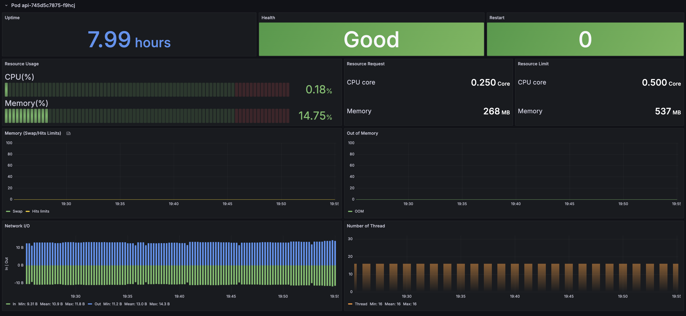
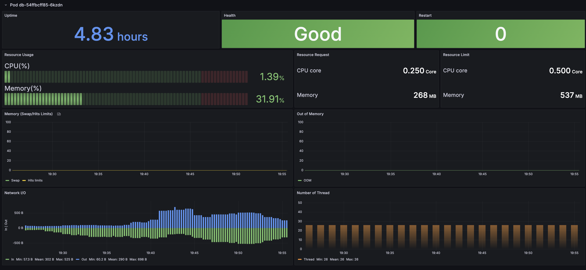
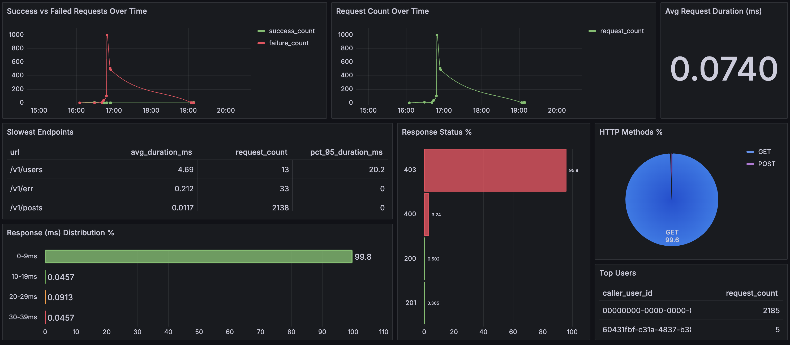
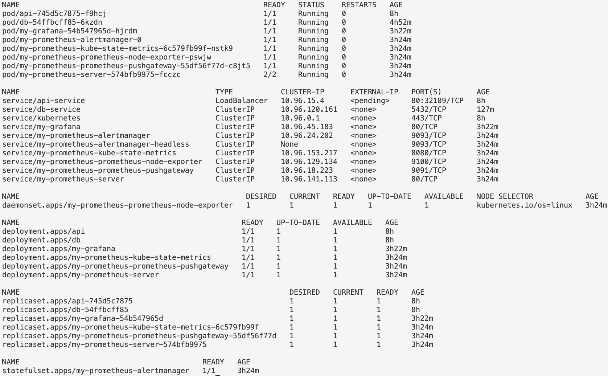

## RSS Aggregator API

- This project develops an API that allows users to authenticate, scrape RSS feeds, follow feeds of their choice, and view posts from the feeds they follow
- The API is tested, dockerised and available on [Docker Hub](https://hub.docker.com/repository/docker/timee98642/rss-agg-api/general)
- Then the API is used in a local Kubernetes application, ending with dashboards for monitoring Kubernetes and the API

*Tech: Go, PostgreSQL, GitHub Actions, Docker, Kubernetes, Prometheus, Grafana*

### Table of Contents:

- [API](#api)
- [CI/CD](#cicd)
- [Kubernetes](#kubernetes)
- [Monitoring & Metrics](#monitoring--metrics)
- [Setup](#setup)
- [Future](#future)
- [Directories Structure](#directories-structure)

## API 


- There are 4 main Entities (User, Feed, Post, FeedFollows) alongside their schemas. Each is in its own table in PostgreSQL

**User queries on `/users`**
- GET (auth): returns a User entity
- POST: creates a User and returns a User

**Feed queries on `/feeds`**
- GET: returns list of Feed entities
- POST (auth): takes in a name and url to scrape its RSS feed and returns a Feed

**Post queries on `/posts`**
- GET (auth): (optionally takes pagination params) returns a list of Post entities for the authenticated user

**FeedFollows queries on `/feed_follows`**
- GET (auth): returns followed feeds for the authenticated user
- POST (auth): the authenticated User follows a Feed and returns a FeedFollow
- DELETE (auth): the authenticated User unfollows a feed

**There are 2 middlewares**
- Authentication (on selected actions)
- Logging request/reponses to the database for monitoring (on all)

(I also tried creating a docs with swagger. The result looks similar to the auto-generated docs by FastAPI - picture in the docs directory)

## CI/CD


The dockerised API is lint, tested, and pushed to [Docker Hub](https://hub.docker.com/repository/docker/timee98642/rss-agg-api/general) using GitHub Actions.

## Kubernetes

This is my local cluster setup.


**API Traffic Flow**
- Users interact with the `api-service` (LoadBalancer), which forwards traffic to the `api pod`
- The api pods handle the request and may need to query the database (`db`)

**Database Access with NetworkPolicy**
- The `api pod` connects to the `db-service`, which routes traffic to `db pods`
- The `db-access-policy` NetworkPolicy allows the `api pod` to access the `db`

**Storage for Database**
- The `db pod` uses Persistent Volume Claims (PVCs) to request storage
- The storage is backed by a Persistent Volume (PV)

**Secrets**
- Database connection information is passed to both `api pod` and `db pod`

## Monitoring & Metrics

- I setup Prometheus (with Helm) for K8s cluster monitoring and metrics. The information is sent to Grafana (setup with Helm) to create dashboards. Here are dashboards pics from the `api pod` and `db pod`

`api pod` view



`db pod` view



- I also setup a dashboard to monitor the API traffic




#### Setup Kubernetes

```bash
kubectl apply -f kubernetes/.

# check everything is good 
kubectl get all

# expose API to local
kubectl port-forward api-pod-name 8080
```

#### Setup Monitoring

```bash
helm repo add prometheus-community https://prometheus-community.github.io/helm-charts

helm repo update

helm install my-prometheus prometheus-community/prometheus

helm repo add grafana https://grafana.github.io/helm-charts

helm repo update

helm install my-grafana grafana-grafana

# check pods/svc with kubectl are running...

# get grafana pwd and save it for login
kubectl get secret -n default my-grafana -o jsonpath="{.data.admin-password}" | base64 --decode ; echo

# port-forward grafana to localhost
kubectl port-forward service/my-grafana 3000:80 --address='0.0.0.0' 

# visit 0.0.0.0:3000 and use admin/pwd
```

You should see something like if everything is ok:



### Future

- send API logs to a dedicated database and/or create a main/copy database pod for writes only to the main, and the copy reads them and is used for dashboards
- try using an ingress controller for exposing the API with K8s
- learn more about Go and implement things like the repository pattern for the API
- add caching to the API

### Directories Structure

```
└── 📁rssagg
    └── 📁.github
        └── 📁workflows
            └── push_img_to_hub.yaml
            └── run_tests.yaml
    └── 📁docs # Go swagger generated API documentation
    └── 📁grafana # Grafana dashboards
        └── api-logs-dashboard.json
        └── k8s-pods-dashboard.json
    └── 📁internal # Go API internals
        └── 📁auth
            └── auth.go
        └── 📁database
            └── db.go
            └── feed_follows.sql.go
            └── feeds.sql.go
            └── logs.sql.go
            └── migration.go
            └── models.go
            └── posts.sql.go
            └── users.sql.go
        └── 📁handlers
            └── api.go
            └── err.go
            └── feed_follows.go
            └── feed.go
            └── middleware_auth.go
            └── middleware_log.go
            └── readiness.go
            └── user.go
        └── 📁mockdb
            └── db.go
        └── 📁rss
            └── rss.go
            └── scraper.go
        └── 📁utils
            └── json.go
            └── models.go
    └── 📁kubernetes # K8s configs
        └── api-deploy-svc.yaml
        └── db-deploy-svc.yaml
        └── db-pv.yaml
        └── db-pvc.yaml
        └── db-secret.yaml
        └── linter-config.yaml
        └── network-policy.yaml
    └── 📁project-info
    └── 📁sqlc # Database migrations
        └── 📁queries
            └── feed_follows.sql
            └── feeds.sql
            └── logs.sql
            └── posts.sql
            └── users.sql
        └── 📁schema
            └── 001_users.sql
            └── 002_users_apikey.sql
            └── 003_feeds.sql
            └── 004_feed_follows.sql
            └── 005_feeds_lastfetchedat.sql
            └── 006_posts.sql
            └── 007_logging.sql
            └── 008_default_user.sql
    └── 📁tests
        └── api_test.go
        └── auth_test.go
        └── containers.go
        └── err_test.go
        └── feeds_test.go
        └── main_test.go
        └── posts_test.go
        └── users_test.go
    └── .gitignore
    └── .pre-commit-config.yaml
    └── docker-compose.yaml
    └── Dockerfile
    └── entrypoint.sh
    └── go.mod
    └── go.sum
    └── main.go
    └── README.md
    └── sqlc.yaml
```
